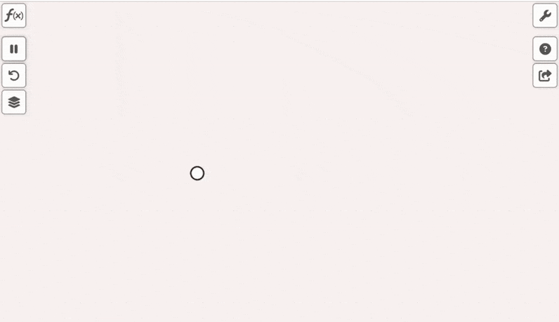

<b>VisualPDE</b> (<a href="https://visualpde.com">visualpde.com</a>) provides programmable, interactive, web-based simulations of partial differential equations (PDEs).

The program for each simulation is included in the link, so the following show some animations along with the corresponding links for simulations I have made for atmospheric dynamics classes. These simulations are mostly based on examples from the website and include simulations with the barotropic vorticity equation, the shallow water equations, and 2D convection (XZ). Some simulations have initial conditions, others are intended to have a disturbance added by clicking. The initial conditions can be removed by setting them to zero, under the 'f(x)' tab in the upper left. So far, the examples focus on f-plane dynamics, although I expect to add more.

If you find any errors, make improvements, or have your own atmospheric dynamics-related simulations, please let me know at Mathew_Barlow@uml.edu.

<b>vorticity equation, simple shear instability: </b>
<a href="[https://visualpde.com/sim/?mini=vQRSCXrW](https://visualpde.com/sim/?mini=6eGPzG-3)">https://visualpde.com/sim/?mini=vQRSCXrW</a> 
<b>vorticity equation, vortex ring instability: </b>
<a href="https://visualpde.com/sim/?mini=vQRSCXrW">https://visualpde.com/sim/?mini=vQRSCXrW</a> 
</img>

<b>vorticity equation, Fujiwhara effect: </b>
<a href="https://visualpde.com/sim/?mini=vemJY_ht">https://visualpde.com/sim/?mini=vemJY_ht</a> 
</img>

<b>shallow water equation, geostrophic adjustment</b> (click to add wind pulse): 
<a href="https://visualpde.com/sim/?mini=-1-Kn1AO">https://visualpde.com/sim/?mini=-1-Kn1AO</a> 
</img>

<b>2D convection, added buoyancy</b> (click to add wind buoyancy): 
<a href="https://visualpde.com/sim/?mini=L6vapilm">https://visualpde.com/sim/?mini=L6vapilm</a> 
</img>

